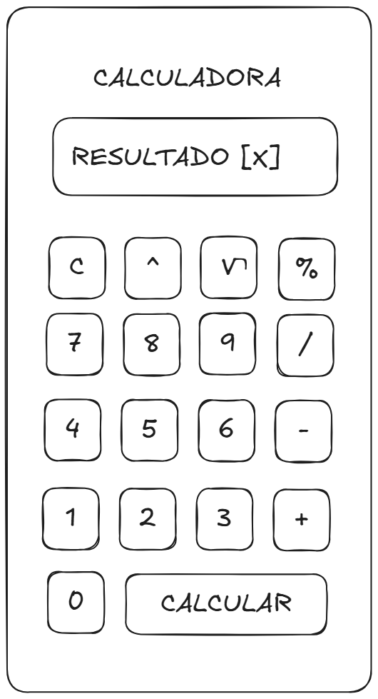
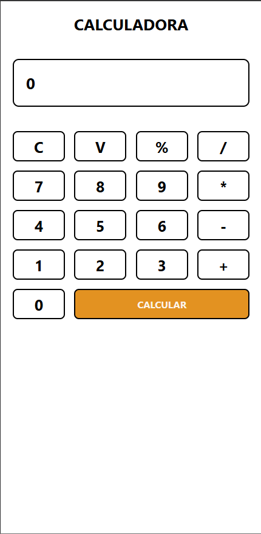

# APLICATIVO MOBILE DE UMA CALCULADORA 👋

## OBJETIVO
   Criar uma Calculadora com a tecnologia React Native capaz de resolver as operações de Adição, Subtração, Multiplicação, Divisão, Raiz quadrada, Porcentagem 

## REGRA DE NEGOCIO
   - O Sistema deverá tratar erros como divisão por 0 ele irá retornar uma mensagem de erro.
   - O sistema deverá resolver 6 operações matematica como:Adição, Subtração, Multiplicação, Divisão, Raiz quadrada, Porcentagem.
   - O Caso o usuario clicar em 'C' para limpar a tela deverá alterar para 0 e zerar as variaveis que foram armazenadas.

## REQUISITOS
   [RF01] - O Software deverá permitir inserir números entre 0 a 9
   [RF02] - A Calculadora deverá permitir inserir operadores como adição, subtração, multiplicação, divisão, raiz quadrada, porcentagem
   [RF03] - A Calculadora deverá ter um botão calcular para realizar os calculos.
   [RF04] - A Calculadora deverá limpar a tela ao pressionar em C 
   [RNF01] - O design deverá ser elegante 

## PROTOTIPOS
   - Foi utilizado a ferramenta 'excalidraw.com' para criar o wireframes do design da Calculadora.
   
   

## CODIGO